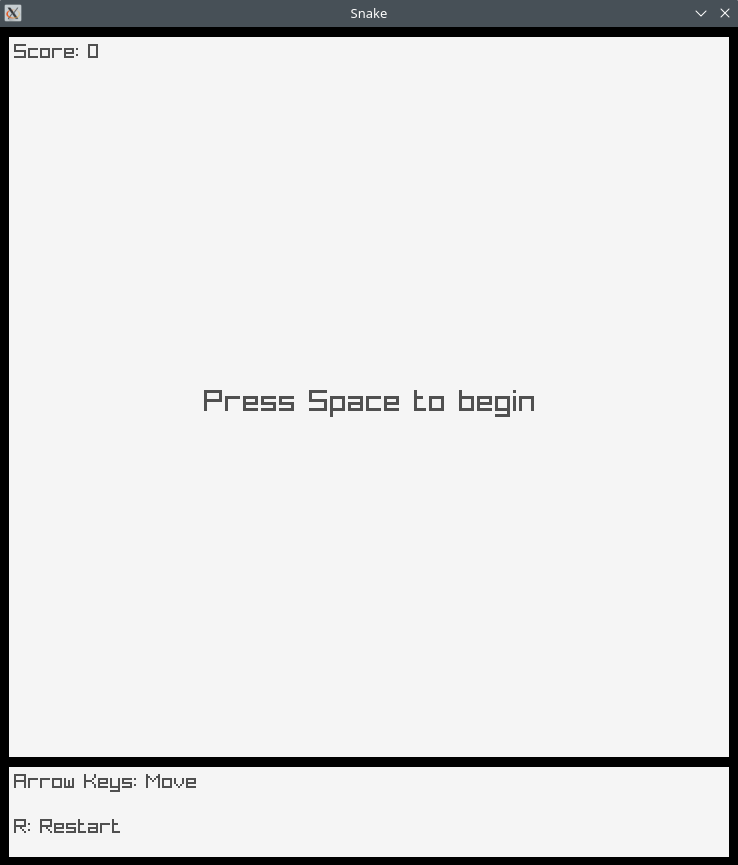
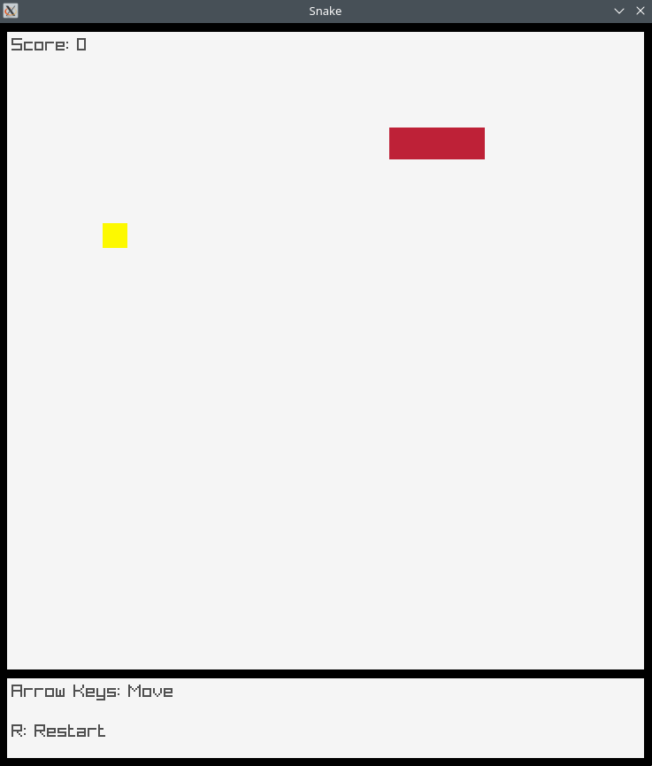

# Snake in C

## About



This project is an inspired by the mobile game of the same name developed in 1998 for the Nokia 6110. In the game, the player must steer a snake which automatically moves in whatever direction the player last entered with the goal of eating as many fruits as possible without eating itself or hitting the sides of the screen.

## Controls

Use the arrow keys to control the snake. Eat fruit to score points and grow the snake. Don't eat the walls and don't eat the snake.

## How to build

By default, only x86_64 Linux is supported, however you can use a different build of Raylib to run on other platforms.

```bash
make
```
